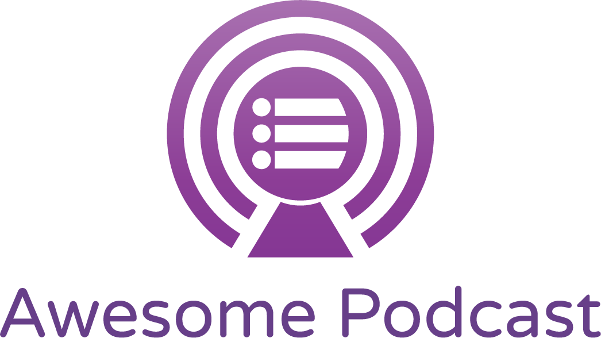

# Awesome Podcasts

> 😎 Curated list of awesome programming podcasts  

---

Table of Content

---

## Beginner

> Podcasts for programming newbies

- [CodeNewbie](http://www.codenewbie.org/podcast) - Stories from people on their coding journey
- [freeCodeCamp Podcast](https://freecodecamp.libsyn.com/) - The official podcast of the freeCodeCamp open source community. Learn to code with free online courses, programming projects, and interview preparation for developer jobs
- [Hello World Podcast](https://wildermuth.com/hwpod) - Interviews with your favorite speakers about how they got started
- [Learn To Code With Me](http://learntocodewith.me/podcast/) - Interviews with people on how they got into coding
- [Start Here FM](http://starthere.fm/) - Beginner-friendly podcast discussing how to improve yourself as a developer
- [Teach Me To Code](https://devchat.tv/teachmetocode) - Interviews with developers and leaders in the Tech industry

## C/C&#43;&#43;

> Podcasts related to C/C&#43;&#43; programming

- [CppCast](http://cppcast.com/) - The first podcast by C&#43;&#43; developers for C&#43;&#43; developers!

## Cloud

> Podcasts related to public clouds

- [AWS Podcast](https://aws.amazon.com/podcasts/aws-podcast/) - Discussing various aspects of the Amazon Web Services (AWS) offering. Each podcast includes AWS news, tech tips, and interviews with startups, AWS partners, and AWS employees
- [AWS TechChat](https://aws.amazon.com/podcasts/aws-techchat/) -  A podcast series offering cloud enthusiasts, IT practitioners and developers the latest thinking and insights from AWS subject matter experts
- [Doppler Cloud Computing Podcast](https://www.cloudtp.com/doppler/podcasts/) - Covering all things cloud while focusing on how to prepare the traditional enterprise to look beyond conventional computing
- [Google Cloud Platform Podcast](https://www.gcppodcast.com/) - Discussing everything from on Google Cloud Platform from App Engine to Big Query
- [Microsoft Cloud Show](http://www.microsoftcloudshow.com/podcast) - Latest news, notes, commentary and listener questions on Microsoft cloud technologies including Windows Azure, Office 365 and SharePoint
- [The Cloud Cast](http://thecloudcast.net/) - Weekly podcast to discuss the technology and organizational changes that are driving the convergence of today&#39;s Data Centers and Cloud Computing. Topics include Cloud Computing | AWS | Azure | GCP | Serverless | DevOps | AppDev | SaaS | IoT

## Conference Talks

> Recordings from conference talks

- [Remote Conference Talks](https://devchat.tv/remote-conf-talks) - This feed contains several of the talks given at Remote Conference put on by Devchat.tv each month. Topics range from Ruby to JavaScript to community to tools and tricks

## Dart

> Podcasts related to Dart Programming Language

- [Dartisans](https://gpodder.net/podcast/dartisans-dart-programming-language-podcast) - News, interviews, and Q&amp;A with the Dart team and community
- [Learning Flutter](https://anchor.fm/learning-flutter) - With this podcast, we are going to learn flutter together

## Data Science

> Podcasts related to Data Science

- [Data Science Storytime](https://www.heavybit.com/library/podcasts/data-science-storytime/) - A podcast all about data, science, stories, and time

## DevOps

> Podcasts related to Operations and DevOps

- [Arrested DevOps](https://www.arresteddevops.com/) - ADO is the podcast that helps you achieve understanding, develop good practices, and operate your team and organization for maximum DevOps awesomeness
- [Devops Cafe](http://devopscafe.org/) - Podcast with John Willis &amp; Damon Edwards
- [DevOps Chat](https://devops.com/) - Where the world meets DevOps
- [DevOps Mastery](http://www.devopsmastery.com/) - This podcast is all about doing the DevOps thing. We are here to help you get from a DevOps newbie to being a DevOps Master
- [DevOps on AWS Radio](https://stelligent.com/tag/podcasts/) - DevOps on AWS Radio covers topics on applying DevOps principles and practices such as Continuous Delivery on the AWS cloud
- [DevOps Radio](http://media.blubrry.com/devops_radio/www.devopsradio.libsyn.com/podcast) - Covering all things related to software delivery
- [Docker for .NET Developers](http://s.ch9.ms/Series/Docker-for-NET-Developers) - An overview of what .NET developers need to know to build containerized applications using Docker
- [DockerCast](https://www.docker.com/) - Dockercast is the official Docker Podcast which covers a wide range of topics including products, projects and contributions from active community members and partners with our host, Docker’s very own – John Willis
- [Kubecast](http://kubecast.com/) - A podcast about kubernetes, schedulers, containers and the new world.This podcast is a series of interviews to relevant people in the community
- [Kubernetes Podcast](https://kubernetespodcast.com/) - A weekly news and interview show with insight from the Kubernetes community
- [PodCTL](http://blog.openshift.com/) - Weekly technology podcast focused on Containers | Kubernetes | Red Hat OpenShift | Cloud Native Applications | Microservices | PaaS | CaaS | DevOps
- [Puppet Podcast](https://puppet.com/podcast_feed) - The Puppet Podcast features Puppet community members talking about the latest trends in configuration management &amp; cloud automation as well as DevOps culture
- [The Food Fight Show](http://foodfight.libsyn.com/) - The Chef Community Podcast, where DevOps engineeers do battle. This is not a cooking show
- [The New Stack Makers](http://soundcloud.com/thenewstackmakers) - The New Stack Makers stream of featured speakers and interviews is all about the new software stacks that change the way we development and deploy software
- [The Ship Show](http://theshipshow.com/podcast/) -  A twice-montly podcast covering the finer points of build engineering, devops, &amp; release management, including discussions, interviews, reviews, and coverage of important release engineering news and happenings

## DotNet

> Podcasts related to .NET and Windows Development

- [.NET Rocks](http://www.dotnetrocks.com/) - A weekly talk show for anyone interested in programming on the Microsoft .NET platform. The shows range from introductory information to hardcore geekiness
- [MS Dev Show](http://msdevshow.com/) - The MS Dev Show is THE podcast for Microsoft developers covering news and topics such as Azure (cloud), Windows, and cross-platform development using MS tools

## Elixir

> Podcasts related to Elixir Programming Language

- [Elixir Fountain](http://elixirfountain.com/) - Bringing you the News &amp; Interviews from around the Elixir Community

## Elm

> Podcasts related to Elm Programming Language

- [Elm Town](https://elmtown.audio/) - About the people making and using the Elm language
- [JavaScript to Elm](https://jstoelm.com/) - A show about learning Elm, Functional Programing, and generally leveling up as a JS developer

## Functional Programming

> Podcasts related to functional programming

- [CoRecursive](https://corecursive.com/) - Interviews with functional programming devs &amp; researchers covering a variety of languages. Language focus is approx. 50% Scala, 50% Haskell/Idris/Everything else
- [Functional Geekery](https://www.functionalgeekery.com/) - All functional programming languages
- [Lambdacast](https://soundcloud.com/lambda-cast) - Functional programming core concepts

## General

> Podcasts related to general programming topics

- [Bad Voltage](https://www.badvoltage.org/) - Technology, Open Source, Politics, Music… Anything and everything is up for grabs, complete with reviews and interviews
- [Building Programmers](https://building.fireside.fm/) - Interviews with software developers about their careers, their current responsibilities, and how they became programmers
- [Changelog](https://changelog.com/podcast) - A weekly podcast that shines a spotlight on the technology and people of open source. It&#39;s about the code, the people, and the community
- [Code &amp; Cast](http://codeand.us/) - A few devs talking with cool people who have a common interest in web and software development and having fun
- [Coder Radio](http://www.jupiterbroadcasting.com/show/coderradio/) - A weekly talk show taking a pragmatic look at the art and business of Software Development and related technologies
- [Coding Blocks](https://www.codingblocks.net/) - Coding Blocks is the podcast and website for learning how to become a better software developer
- [Community Pulse](https://communitypulse.io/) - The spot for community managers and developer evangelists who are looking for information on community building
- [Complete Developer](http://completedeveloperpodcast.com/) - A podcast by coders for coders about all aspects of life as a developer
- [Developer on Fire](http://developeronfire.com/) - Stories from inspiring people in and around software
- [Developer Tea](https://spec.fm/podcasts/developer-tea) - A podcast for developers designed to fit inside your tea break
- [Developing Up](http://www.developingup.com/) - A podcast focused on the non-technical side of being a developer
- [devRant Podcast](https://soundcloud.com/devrantapp) - A weekly podcast interviewing prominent software developers, followed by a discussion with several devRant community members, and wrapped by with some devRant news and updates
- [FLOSS Weekly](https://twit.tv/shows/floss-weekly) - A weekly talk show with the most interesting and important people in the Open Source and Free Software community
- [Founders Talk](https://changelog.com/founderstalk) - An interview podcast, featuring in-depth, one on one, conversations with Founders
- [Freelancer&#39;s Show](https://devchat.tv/freelancers) - The Freelancers&#39; Show discusses the challenges that freelancers face. The panel includes technology freelancers and entrepreneurs with many years of experience
- [Full Stack Radio](http://www.fullstackradio.com/) - A podcast for developers interested in building great software products
- [Functional Geekery](https://www.functionalgeekery.com/) - A podcast on Functional Programming, covering topics across multiple languages
- [Greater Than Code](https://www.greaterthancode.com/podcast/) - The podcast for coders who care by coders who care
- [Hanselminutes](http://hanselminutes.com/) - A weekly talkshow on tech
- [Herding Code](http://herdingcode.com/) - Herding Code is a weekly podcast that explores different technology-related topics
- [Mapping The Journey](https://www.mappingthejourney.com/) - A Podcast where we unmask the people who are making tremendous strides in tech, yet whose stories are seldom heard
- [Request For Commits](https://changelog.com/rfc) - Exploring different perspectives in open source sustainability. It&#39;s about the human side of code
- [Second Career Devs](https://secondcareerdevs.com/episodes) - Each episode of the Second Career Devs podcast focuses on a guest who became a software engineer after a previous career
- [Shop Talk Show](http://shoptalkshow.com/) - An internet radio show about the internet
- [Simple Programmer](https://simpleprogrammer.com/podcasts/) - John Sonmez interviews guests and shares everything he knows to help you become a top performing software developer
- [Soft Skills Engineering](https://softskills.audio/) - A weekly Q &amp; A podcast for software developers who want to level up their non-technical engineering skills
- [Software Engineering Daily](https://softwareengineeringdaily.com/) - Features daily interviews about technical software topics
- [Software Engineering Radio](http://www.se-radio.net/) - A weekly podcast targeted at the professional software developer that aims to  be a lasting educational resource, not a newscast
- [Talking Code](http://talkingcode.com/) - Short expert interviews that help you decode what developers are saying
- [The Deep End Podcast](https://soundcloud.com/digitaloceanpodcast) - A place where engineers talk to other engineers about tech &amp; other stuff
- [Toolsday](http://toolsday.io/) - A 20-minute podcast about the latest in tech tools, tips, and tricks on Tuesdays
- [Women Who Code Blogposts](https://womenwhocoderadio.blogspot.com/) - Interviews, moderatings, and musings about the state of women in high tech industry

## Go

> Podcasts related to Go Programming Language

- [Go Gab](https://www.briefs.fm/go-gab) - A podcast about everything Go. We&#39;ll explore syntax, new libraries, its concurrency model, and what makes it unique. Anything Go-related is on the table!
- [Go Time](https://changelog.com/gotime) - A weekly panelist podcast discussing the Go programming language, the community, and everything in between

## Hardware

> Podcasts related to Hardware Programming

- [IoT Podcast](http://iotpodcast.com/) - A weekly podcast exploring latest IoT tech and topics
- [Raspberry PiPod Podcast](http://www.recantha.co.uk/blog/) - A bi-weekly podcast/videocast for Raspberry Pi enthusiasts containing the latest news, details of new and updated products, a look at related crowdfunding campaigns, information about upcoming events and a look at some featured Raspberry Pi projects
- [The Pi Podcast](http://thepipodcast.com/) - The Pi Podcast is a show by members of the Raspberry Pi community for the Raspberry Pi community

## Haskell

> Podcasts related to Haskell Programming Language

- [Haskell Cast](https://www.haskellcast.com/) - Core haskell concepts

## Javascript

> Podcasts related to JavaScript Programming Language

- [5-Minutes of JavaScript](https://fivejs.codeschool.com/) - The latest news in the JavaScript community in 5 minutes
- [Adventures In Angular](https://devchat.tv/adv-in-angular) - Adventures in Angular is a weekly podcast dedicated to the Angular JavaScript framework and related technologies, tools, languages, and practices
- [Angular Air](https://angularair.com/) - A live video podcast all about Angular
- [FiveJS](https://fivejs.codeschool.com/) - The latest news in the JavaScript community
- [JavaScript Air](https://javascriptair.com/) - The live broadcast podcast all about JavaScript
- [JavaScript Jabber](https://devchat.tv/js-jabber) - JavaScript Jabber is a weekly discussion about JavaScript, front-end development, community, careers, and frameworks
- [JS Party](https://changelog.com/jsparty) - A community celebration of JavaScript and the web
- [NodeUp](http://nodeup.com/) - A Node.js podcast
- [React30](https://react30.com/) - A 30-minute podcast about React and all things JavaScript
- [Space Dojo Show](https://show.spacedojo.com/) - A roundtable podcast about Javascript

## Kotlin

> Podcasts related to Kotlin Programming Language

- [Kotlin](http://talkingkotlin.com/) - Kotlin and more

## Miscellaneous

> Podcasts that don&#39;t fit into a name, but are still about programming

- [Dads in Development](http://www.dadsindev.com/) - A podcast about dads and geeky stuff
- [Dev.to](https://dev.to/pod) - A collection of podcasts that may or may not be listed here
- [Heavybit Industries](https://www.heavybit.com/library/podcasts/) - A collection of podcasts that may or may not be listed here

## Mobile

> Podcasts related to Mobile Programming

- [Android Developers Backstage](http://feeds.feedburner.com/blogspot/AndroidDevelopersBackstage&lt;Paste&gt;) - Podcast interviewing Google engineers about the latest Android APIs
- [Android Snacks](http://androidsnacks.com/) - The TL;DR of last week&#39;s Android developer news
- [Context Podcast](https://github.com/artem-zinnatullin/TheContext-Podcast) - Podcast that discusses on various frameworks and tools available in Android Community
- [Fragmented Podcast](http://fragmentedpodcast.com/category/episodes/) - An Android Developer Podcast
- [iPhreaks](https://devchat.tv/iphreaks) - The iPhreaks Show is a weekly group discussion about iOS development and related technology by development veterans. We discuss Apple, tools, practices, and code
- [More Than Just Code](http://mtjc.fm/) - A show about mobile development (&amp; for those of you driving at home.)
- [React Native Radio](https://devchat.tv/react-native-radio) - React Native Radio is a weekly discussion of the tools, techniques, and technologies used to build mobile applications with JavaScript and React done by developers regularly using React Native

## Python

> Podcasts related to Python Programming Language

- [Import This](https://www.kennethreitz.org/import-this/) - A Python Podcast for Humans
- [podcast.__init__](https://www.podcastinit.com/) - The Podcast About Python and the People Who Make It Great
- [Python Bytes](https://pythonbytes.fm/) - Python headlines delivered directly to your earbuds
- [Talk Python To Me](https://talkpython.fm/episodes/all) - A podcast on Python and related technologies

## Reason

> Podcasts related to ReasonML Programming Language

- [Reason Town](https://reason.town/) - A podcast about the ReasonML language and the community that makes it awesome

## Ruby

> Podcasts related to Ruby Programming Language

- [Rails Clips](https://devchat.tv/rails-clips) - Rails Clips is a video series about building web applications with Ruby on Rails
- [Ruby on Rails Podcast](http://5by5.tv/rubyonrails) - The Ruby on Rails Podcast, a weekly conversation about Ruby on Rails, open source software, and the programming profession
- [Ruby5](https://ruby5.codeschool.com/) - The latest news in the Ruby and Rails community in 5 minutes
- [The Ruby Rogues](https://devchat.tv/ruby-rogues) - The Ruby Rogues podcast is a panel discussion about topics relating to programming, careers, community, and Ruby. We release a conversation with notable programmers and Rubyists each week to help programmers advance in their careers and skills

## Rust

> Podcasts related to Rust Programming Language

- [Rusty Spike Podcast](https://rusty-spike.blubrry.net/) - A podcast for Rust and Servo
- [The New Rustacean](http://www.newrustacean.com/show_notes/) - A podcast about learning the programming language Rust—from scratch

## Security

> Podcasts related to Information Security

- [AppCanary Podcast](http://podcast.appcanary.com/) - Appcanary makes sure you never run vulnerable software on your servers
- [Application Security Podcast](https://www.appsecpodcast.org/) - Application security for the win: reach new people, explain the details, and leave the echo chamber in the dust
- [Brakeing Down Security](http://www.brakeingsecurity.com/) - A podcast all about the world of Security, Privacy, Compliance, and Regulatory issues that arise in today&#39;s workplace
- [Darknet Diaries](https://darknetdiaries.com/) - True stories from the dark side of the Internet
- [Data Driven Security](http://datadrivensecurity.info/podcast/) - A podcast on discovery and decision making through data in information security, covering all levels and aspects of data analysis &amp; visualization, plus speaking with pioneers in the field of security data science and seasoned veterans in information security
- [Defensive Security Podcast](http://www.defensivesecurity.org/) - The Defensive Security podcast is an attempt to look at recent security news and pick out lessons we can apply to the organizations we are charged with keeping secure
- [DevelopSec](https://developsec.libsyn.com/) - Developing Security Awareness
- [Down The Security Rabbithole](http://podcast.wh1t3rabbit.net/) - Interesting security interviews and news analysis
- [Exploring Information Security](http://www.timothydeblock.com/eis/) - Weekly interviews with Information Security experts on various security topics
- [In-Security](http://in-security.org/) - An information security podcast, from the ground up
- [Open Source Security](http://www.opensourcesecuritypodcast.com/) - A podcast about security with an open source slant
- [OWASP 24/7](http://https//www.owasp.org/index.php/OWASP_Podcast) - OWASP 24/7 is a recorded series of discussions with project leads within OWASP. Each week, we talk about the new projects that have come on board, updates to existing projects and interesting bits of trivia that come across our desk
- [SANS Internet Storm Center Daily](https://isc.sans.edu/podcast.html) - Daily 5-10 minute information security threat updates
- [Security Boulevard Chat](https://securityboulevard.com/) - Security Boulevard is the destination for the security community to stay up on the latest news, discussion and analysis. Home of the Security Bloggers Network, Security Boulevard has more security related content than anywhere else on the web
- [Security Intelligence](https://securityintelligence.com/media-type/podcasts/) - A cybersecurity podcast brought to you by IBM
- [Security Nation](https://www.rapid7.com/resources/podcasts/) - Security Nation is a podcast dedicated to covering all things infosec
- [Security Now](https://twit.tv/shows/security-now) - A discussion of hot topics in security today
- [Security Weekly](https://securityweekly.com/) - A security podcast network for information security professionals, by information security professionals
- [Smashing Security](https://www.smashingsecurity.com/) - News and views from the world of cybersecurity, hacking, and internet threats
- [Source Code Podcast](http://chrissanders.org/podcast/) - Source Code is focused on the people that push information security forward and battle in the trenches every day
- [The CyberWire](https://thecyberwire.com/podcasts/) - A look at what&#39;s happening in cyberspace
- [The Secure Developer](http://www.heavybit.com/library/podcasts/the-secure-developer/) - A podcast about security for developers, covering tools and best practices
- [The Social Engineering Podcast](https://www.social-engineer.org/category/podcast/) - A monthly podcast exploring different security topics
- [The Threatpost Podcast](https://threatpost.com/category/podcasts/) - A podcast by Threatpost, an independent news site which is a leading source of information about IT and business security for hundreds of thousands of professionals worldwide
- [Troy Hunt&#39;s Weekly Update](https://www.troyhunt.com/tag/weekly-update/) - A weekly update on Information Security topics
- [Unsupervised Learning](https://danielmiessler.com/podcast/) - The most interesting stories in infosec, technology, and humans
- [Web Security Warriors](https://devchat.tv/web-sec-warriors) - Web Security Warriors is a weekly discussion by developers about keeping websites, data, servers, and other internet outposts secure

## Unix

> Podcasts related to Linux/Unix Operating Systems

- [BSD Now](http://www.jupiterbroadcasting.com/show/bsdnow/) - A weekly show covering the latest developments in the world of the BSD family of operating systems. News, Tutorials and Interviews for new users and long time developers alike
- [Destination Linux](http://destinationlinux.org/) - Destination Linux is hosted by two everyday guys who love running Linux. The discussions are down to earth and based on their real world experiences
- [GNU World Order](http://gnuworldorder.info/) - An internet audio show about GNU, Linux, UNIX, and other technical and geeky topics
- [Late Night Linux](http://latenightlinux.com/) - Late Night Linux is a podcast that takes a look at what’s happening with Linux and the wider tech industry. Every two weeks, Joe, Jesse, Ikey and Félim discuss the latest news and releases, and the broader issues and trends in the world of free and open source software
- [Linux Action Show](http://www.jupiterbroadcasting.com/show/linuxactionshow/) - The worlds #1 Linux podcast. A weekly show that covers the best in the open source and Linux world. Get a solid dose of Linux, gadgets, howto, reviews, and news every week!
- [Linux Unplugged](http://www.jupiterbroadcasting.com/show/linuxun/) - The Linux Action Show with no prep, no limits, and tons of opinion. An open show powered by community LINUX Unplugged takes the best attributes of open collaboration and focuses them into a weekly lifestyle show about Linux

## Web

> Podcasts related to everything Web outside of JavaScript

- [Code Catchup](http://codercatchup.com/) - Catching up with various web developers, web designers and unicorns
- [CodePen Radio](https://blog.codepen.io/radio/) - A podcast all about what it&#39;s like running a small web software business. The good, the bad, and the ugly
- [Front End Five](https://frontendfive.codeschool.com/) - All of your Front-end News in 5 Minutes
- [Front End Friday](http://frontendfriday.fi/) - A podcast on HTML and the web
- [Front End Happy Hour](http://frontendhappyhour.com/) - Discussions around frontend topics
- [JAMStack Radio](https://www.heavybit.com/library/podcasts/jamstack-radio/) - A show all about the JAMstack, a new way to build fast &amp; secure apps or websites
- [Modern Web](http://www.modern-web.org/#/modern-web-podcast) - Discussions about all things related to modern web development
- [Syntax](https://Syntax.fm) - A Tasty Treats Podcast for Web Developers
- [The Big Web Show](http://5by5.tv/bigwebshow) - The award winning Big Web Show features special guests and topics like web publishing, art direction, content strategy, typography, web technology, and more. It&#39;s everything web that matters
- [The Full Stack Podcast](http://www.devcannon.com/thefullstack/) - The Full Stack is a podcast dedicated to modern software development, with an emphasis on how it relates to web development
- [The Rise of Frontend Engineering](https://theriseoffrontendengineering.com/podcast/) - A weekly podcast for Frontend Engineers interested in getting better at their craft
- [The Web Ahead](http://5by5.tv/webahead) - Conversations with world experts on changing technologies and future of the web. The Web Ahead is your shortcut to keeping up
